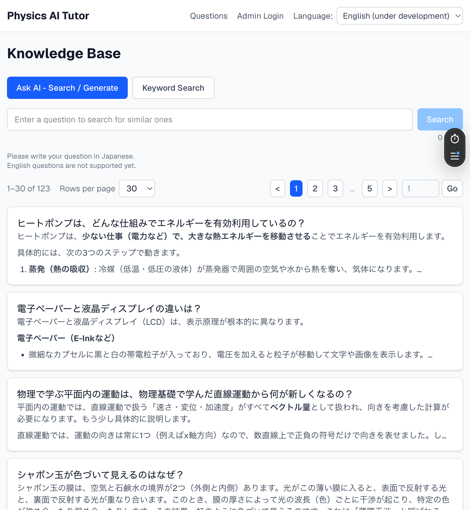
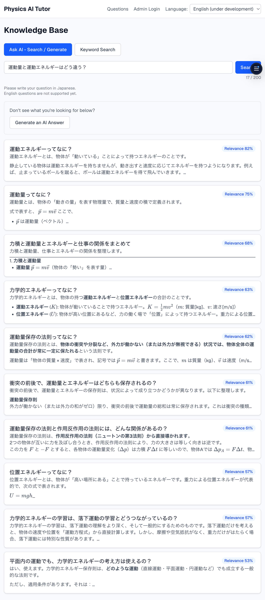
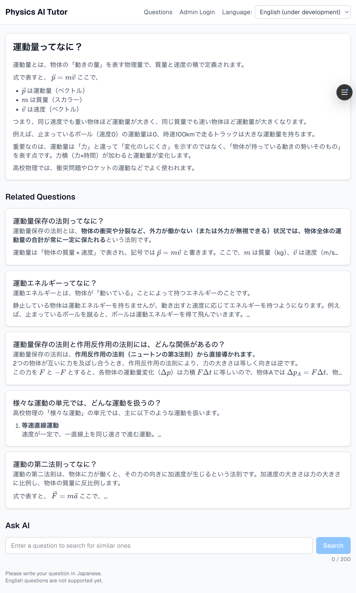
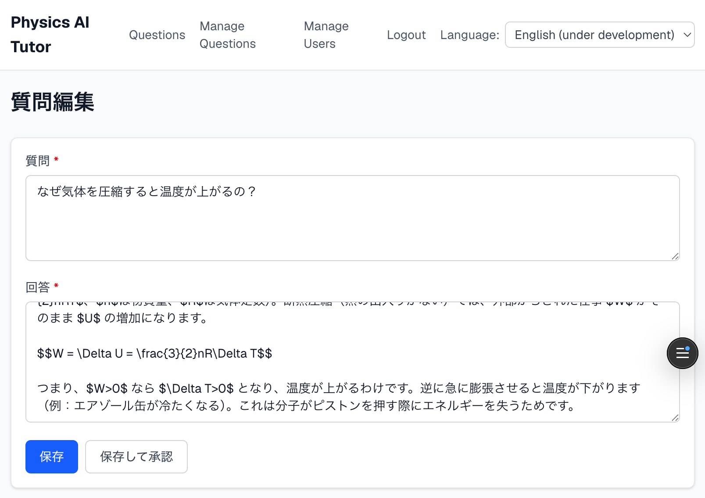
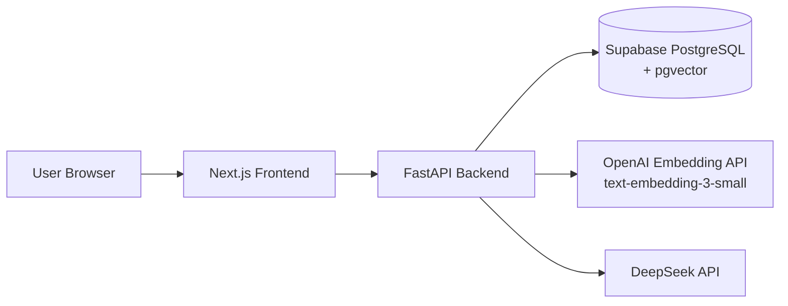
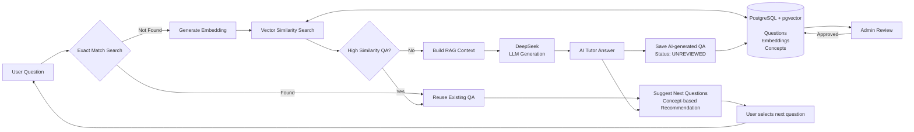

# Physics AI Tutor


Physics AI Tutor is an AI-assisted learning platform for high school physics students.

I previously worked as a high school physics teacher in Japan for three years. Through teaching experience, I noticed that many students struggled not only with understanding physics concepts but also with formulating the right questions.

This project aims to help students learn physics by combining:

- Structured educational knowledge management
- Semantic search using vector embeddings
- Retrieval-Augmented Generation (RAG)
- Human review workflows for AI-generated content

The goal is to build a reliable AI tutor that explains physics based on verified educational knowledge.

---

## Live Application

https://ai-tutor.pencil-net.com

---

## Getting Started

To run the project locally, see [docs/development.md](docs/development.md).

---

## Screenshots

English UI mode, with question and answer content still in Japanese (see [Features](#features)).

### Home / question list


### AI similarity search results
<details><summary>Screen Shot</summary>



</details>

### Question detail page
<details><summary>Screen Shot</summary>



</details>

### Manage questions
<details><summary>Screen Shot</summary>


</details>

### Edit question
<details><summary>Screen Shot</summary>



</details>

---

## System Architecture



The backend acts as the central application layer, connecting the frontend, knowledge database, embedding service, and LLM generation service.

---

## AI/RAG Architecture

The application is designed to minimize unnecessary LLM usage by prioritizing existing educational knowledge.



### Design Principles

- Prefer existing verified knowledge over generating new answers
- Reduce unnecessary LLM API calls
- Ground AI responses with retrieved educational content
- Improve knowledge quality through human review

---

## Features

### AI-assisted Physics Question Answering

- Search existing physics explanations using semantic similarity
- Retrieve relevant educational content before generation
- Generate AI answers using Retrieval-Augmented Generation (RAG)
- Store generated answers for future knowledge reuse

### Semantic Question Search

- Generate embeddings for physics questions
- Store vectors using PostgreSQL + pgvector
- Search similar questions using cosine similarity
- Reuse existing knowledge before calling LLMs

### Knowledge Management

- Admin dashboard for educational content management
- Review workflow for AI-generated answers
- Separate approved content from unreviewed AI outputs

### Authentication and Authorization

- JWT-based authentication with HttpOnly cookies
- Role-based access control
- Admin-only management operations

### Responsive Web Application

- Next.js-based frontend
- Responsive UI for desktop and mobile browsers
- Japanese / English UI switching support

---

## Tech Stack

### Backend

- Python
- FastAPI
- SQLAlchemy
- PostgreSQL
- pgvector
- Alembic
- pytest

### Frontend

- Next.js (App Router)
- React
- TypeScript
- Tailwind CSS

### Infrastructure

- Docker Compose
- Vercel
- Render
- Supabase PostgreSQL

### AI

- OpenAI Embedding API (`text-embedding-3-small`)
- DeepSeek API for LLM generation

---

## Project Structure

```
physics-ai-tutor
├── backend
│   ├── physics_ai_tutor     # FastAPI application
│   ├── tests                # Backend tests
│   ├── alembic              # Database migrations
│   └── pyproject.toml
│
├── frontend
│   ├── src                  # Next.js application
│   ├── public
│   └── package.json
│
├── docs
│   └── development.md       # Development guide
│
├── docker-compose.yml
├── README.md
└── LICENSE
```

---

## Deployment

Production environment:

- Frontend: Vercel
- Backend: Render
- Database: Supabase PostgreSQL

---

## Future Improvements

- Expand English language support
- Support more physics domains
- Improve AI answer evaluation workflow
- Add more educational content generation features

---

## License

This project is licensed under the MIT License.
